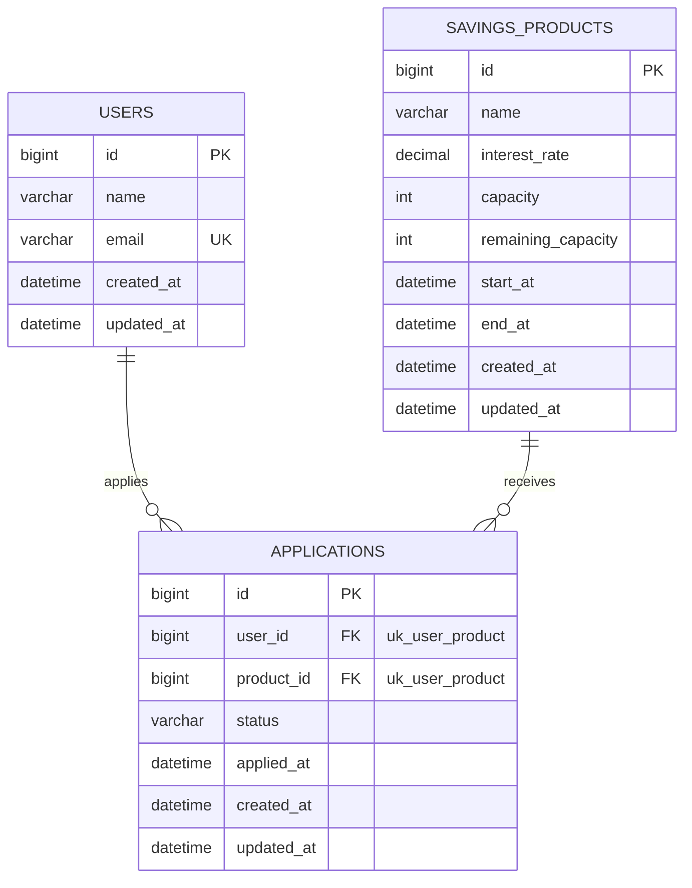

# Concurrent Savings ERD

## 1. 개요

이 문서는 Concurrent Savings의 데이터 모델 초안을 정의한다.

MVP에서는 선착순 특판 적금 신청 흐름을 구현하기 위해 다음 3개 테이블을 우선 사용한다.

- users
- savings_products
- applications

대기열과 알림 관련 테이블은 2차 구현에서 추가한다. 멱등성은 별도 테이블이 아니라 `applications.idempotency_key` 컬럼으로 2차 구현에서 추가한다.

## 2. MVP ERD

## 3. 제약과 인덱스

### 제약

| 테이블 | 이름 | 컬럼 | 종류 | 목적 |
| --- | --- | --- | --- | --- |
| users | uk_users_email | (email) | UNIQUE | 이메일 중복 방지 |
| applications | uk_user_product | (user_id, product_id) | UNIQUE | 동일 유저의 같은 상품 중복 신청 차단 |

`uk_user_product`는 중복 신청 방지의 최종 방어선이다. 애플리케이션 레벨에서 먼저 중복 여부를 확인하더라도, 동시 요청 상황에서는 확인과 저장 사이에 다른 트랜잭션이 끼어들 수 있으므로 DB 제약을 반드시 함께 둔다.

### 인덱스

| 테이블 | 이름 | 컬럼 | 목적 |
| --- | --- | --- | --- |
| applications | idx_product_status_applied_id | (product_id, status, applied_at, id) | 상품별 신청 목록 조회와 대기 순서 정렬 |

상품별 신청 목록 조회는 `product_id`로 걸러 `status`로 필터링하고 `(applied_at, id)`로 정렬한다. 대기 신청이 많이 쌓인 상태에서 이 인덱스가 없으면 조회가 풀 스캔이나 filesort로 떨어질 수 있다. 로드맵 10단계에서 실행 계획을 확인하며 검증한다.

## 4. 시각 저장 정책

모든 시각 컬럼은 UTC 기준으로 저장한다. `datetime`은 타임존을 저장하지 않으므로, 저장 값이 UTC라는 것을 애플리케이션에서 보장한다.

- DB 컬럼 타입은 `datetime`을 사용한다.
- 엔티티는 `LocalDateTime` 대신 `Instant` 또는 `OffsetDateTime`을 사용한다.
- API 응답은 오프셋을 포함한 ISO-8601 형식으로 변환해 내려준다.

`LocalDateTime`을 사용하면 로컬 개발 환경(KST)과 배포 환경(UTC)에서 `start_at`, `end_at` 비교 결과가 달라져 신청 기간 판정이 어긋난다.

## 5. 컬럼 참고

### applications.applied_at 과 created_at

- `applied_at`은 신청이 접수된 업무 시각이다. 대기 순서 판단과 대기열 정렬 기준으로 사용한다. 동시 신청으로 값이 같을 수 있으므로 정렬은 `(applied_at ASC, id ASC)`로 확정한다.
- `created_at`은 레코드가 생성된 시각으로 감사 목적의 공통 컬럼이다.

MVP에서는 두 값이 사실상 같지만, 2차 구현에서 대기열 승격이나 재처리가 생기면 `applied_at`은 최초 신청 시각으로 유지하고 `created_at`과 분리된다.

### savings_products.remaining_capacity

`remaining_capacity`는 `SUCCESS` 상태 신청 수에서 파생되는 값이므로 동시성 제어가 없으면 실제 신청 수와 어긋날 수 있다. 이 불일치를 재현하고 해결하는 것이 동시성 학습의 핵심이므로 별도 컬럼으로 유지한다. 로드맵 4단계에서 `capacity - COUNT(SUCCESS) = remaining_capacity` 정합성을 검증하는 테스트를 함께 작성한다.
