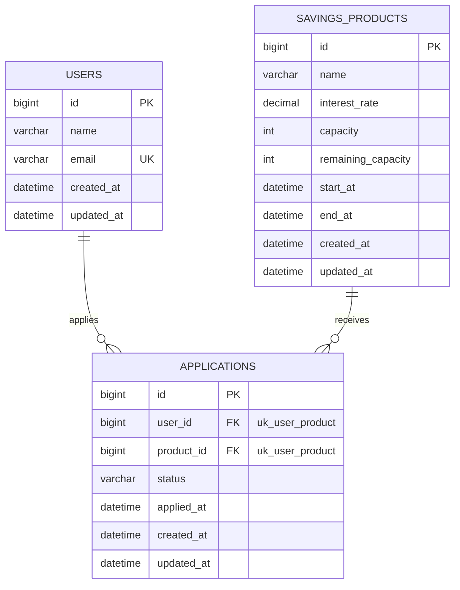

# Concurrent Savings ERD

## 1. 개요

이 문서는 Concurrent Savings의 데이터 모델 초안을 정의한다.

MVP에서는 선착순 특판 적금 신청 흐름을 구현하기 위해 다음 3개 테이블을 우선 사용한다.

- users
- savings_products
- applications

대기열과 알림 관련 테이블은 2차 구현에서 추가한다. 멱등성은 별도 테이블이 아니라 `applications.idempotency_key` 컬럼으로 2차 구현에서 추가한다.

실제 스키마는 Flyway 마이그레이션 `src/main/resources/db/migration/V1__init_schema.sql`이 관리한다. 이 문서와 마이그레이션이 어긋나면 마이그레이션이 기준이다.

## 2. MVP ERD

## 3. 제약과 인덱스

### 제약

| 테이블 | 이름 | 컬럼 | 종류 | 목적 |
| --- | --- | --- | --- | --- |
| users | uk_users_email | (email) | UNIQUE | 이메일 중복 방지 |
| applications | uk_user_product | (user_id, product_id) | UNIQUE | 동일 유저의 같은 상품 중복 신청 차단 |

`uk_user_product`는 중복 신청 방지의 최종 방어선이다. 애플리케이션 레벨에서 먼저 중복 여부를 확인하더라도, 동시 요청 상황에서는 확인과 저장 사이에 다른 트랜잭션이 끼어들 수 있으므로 DB 제약을 반드시 함께 둔다.

### 인덱스

| 테이블 | 이름 | 컬럼 | 목적 |
| --- | --- | --- | --- |
| applications | idx_product_status_applied_id | (product_id, status, applied_at, id) | 상품별 신청 목록 조회와 대기 순서 정렬 |

상품별 신청 목록 조회는 `product_id`로 걸러 `status`로 필터링하고 `(applied_at, id)`로 정렬한다. 대기 신청이 많이 쌓인 상태에서 이 인덱스가 없으면 조회가 풀 스캔이나 filesort로 떨어질 수 있다. 로드맵 10단계에서 실행 계획을 확인하며 검증한다.

## 4. 시각 저장 정책

모든 시각 컬럼은 UTC 기준으로 저장한다. `datetime`은 타임존을 저장하지 않으므로, 저장 값이 UTC라는 것을 애플리케이션에서 보장한다.

- DB 컬럼 타입은 `datetime(6)`을 사용한다. `applied_at`의 정밀도가 낮으면 동시 신청 시 같은 값이 과도하게 발생해 대기 순서 검증이 어려워진다.
- 엔티티 필드 타입은 `Instant`로 통일한다. `LocalDateTime`은 사용하지 않는다.
- API 응답은 오프셋을 포함한 ISO-8601 형식으로 변환해 내려준다.

`LocalDateTime`을 사용하면 로컬 개발 환경(KST)과 배포 환경(UTC)에서 `start_at`, `end_at` 비교 결과가 달라져 신청 기간 판정이 어긋난다.

`OffsetDateTime`도 사용하지 않는다. `datetime` 컬럼에는 오프셋을 저장할 수 없어, `hibernate.jdbc.time_zone: UTC` 설정에 따라 저장 시 UTC로 정규화되고 조회 시 원래 오프셋이 아닌 UTC 기준으로 복원된다. 보존되지 않는 정보를 타입으로 표현하게 되므로 `Instant`를 쓴다.

## 5. 컬럼 참고

### applications.applied_at 과 created_at

- `applied_at`은 신청이 접수된 업무 시각이다. 대기 순서 판단과 대기열 정렬 기준으로 사용한다. 동시 신청으로 값이 같을 수 있으므로 정렬은 `(applied_at ASC, id ASC)`로 확정한다.
- `created_at`은 레코드가 생성된 시각으로 감사 목적의 공통 컬럼이다.

MVP에서는 두 값이 사실상 같지만, 2차 구현에서 대기열 승격이나 재처리가 생기면 `applied_at`은 최초 신청 시각으로 유지하고 `created_at`과 분리된다.

### savings_products.remaining_capacity

`remaining_capacity`는 `SUCCESS` 상태 신청 수에서 파생되는 값이므로 동시성 제어가 없으면 실제 신청 수와 어긋날 수 있다. 이 불일치를 재현하고 해결하는 것이 동시성 학습의 핵심이므로 별도 컬럼으로 유지한다. 로드맵 4단계에서 `capacity - COUNT(SUCCESS) = remaining_capacity` 정합성을 검증하는 테스트를 함께 작성한다.

## 6. 시드데이터

시드는 `src/main/resources/db/seed/R__seed_data.sql`이 관리한다. 관리자 상품 등록 API를 구현하지 않으므로 특판 적금 상품은 시드로만 만들어진다.

### 적용 범위

Flyway location을 둘로 나눈다.

| location | 내용 | 적용 환경 |
| --- | --- | --- |
| `classpath:db/migration` | 스키마 | 전체 (Spring Boot 기본값) |
| `classpath:db/seed` | 시드 | local 프로파일만 |

`application-local.yaml`에서만 `spring.flyway.locations`에 `db/seed`를 추가한다. `@DataJpaTest`가 Flyway 자동 설정을 포함하므로, 시드를 `db/migration`에 두면 모든 테스트가 유저 10명과 상품 4개를 안고 시작하게 되어 4단계 정합성 검증 테스트의 기준선이 흐려진다. 테스트는 빈 스키마에서 필요한 데이터를 직접 만든다. 이 분리는 `SeedIsolationTest`가 지킨다.

### repeatable 마이그레이션을 쓰는 이유

Flyway는 여러 location을 하나의 버전 시퀀스로 합친다. 시드를 `V900__seed_data.sql` 같은 versioned 마이그레이션으로 두면, 로컬에서 V900을 적용한 뒤 `V2__add_idempotency_key.sql`을 추가하는 순간 이미 적용된 버전보다 낮은 버전이 나타나 Flyway가 실패한다(`outOfOrder` 기본값 false). 2차 구현에서 `idempotency_key` 컬럼 추가가 예정되어 있으므로 이 상황은 반드시 온다.

repeatable 마이그레이션은 항상 모든 versioned 마이그레이션 이후에 실행되므로 버전 충돌이 없고, 시드 내용을 고치면 체크섬이 바뀌어 자동으로 다시 적용된다.

### 재실행 시 동작

repeatable은 다시 실행되므로 시드는 로컬 DB를 알려진 초기 상태로 되돌린다. `applications`를 전부 지운 뒤 users와 savings_products를 명시적 id로 upsert한다.

신청 내역을 남긴 채 `remaining_capacity`만 정원 값으로 되돌리면 `capacity - COUNT(SUCCESS) = remaining_capacity`가 깨진 상태로 로컬 DB가 시작된다. 이 삭제는 시드 파일을 수정했을 때만, local 프로파일에서만 일어난다.

id를 고정하는 것은 멱등성을 위한 것이면서 `X-User-Id: 1`처럼 헤더에 바로 쓸 수 있게 하려는 목적도 있다.

### 상품 구성

| id | 이름 | interest_rate | capacity | start_at | end_at | 재현하는 상태 |
| --- | --- | --- | --- | --- | --- | --- |
| 1 | 선착순 특판 적금 100좌 | 5.50 | 100 | -1일 | +7일 | 진행 중, 정원 넉넉 |
| 2 | 한정 특판 적금 3좌 | 7.00 | 3 | -1일 | +7일 | 진행 중, 정원 소량. WAITING 재현용 |
| 3 | 오픈 예정 특판 적금 | 6.00 | 50 | +3일 | +10일 | 신청 기간 전. 실패 응답 |
| 4 | 종료된 특판 적금 | 4.50 | 20 | -30일 | -1일 | 신청 기간 후. 실패 응답 |

유저는 id 1~10을 만든다. 부하 테스트용 대량 유저는 10단계에서 필요해지면 별도 시드로 추가한다.

`applications`는 시드에 넣지 않는다. 신청 데이터를 미리 넣으면 `remaining_capacity`와의 정합성을 시드 작성자가 손으로 맞춰야 하고, 4단계 정합성 검증 테스트의 기준선이 흐려진다.

### 시각 표기

`start_at`, `end_at`은 위 표처럼 상대값으로 넣는다. 절대 시각을 하드코딩하면 몇 달 뒤 "진행 중" 상품이 전부 마감되어 신청 API를 테스트할 수 없다.

`NOW()`가 아니라 `UTC_TIMESTAMP(6)`을 쓴다. `NOW()`는 세션 타임존을 따라가므로 4절의 UTC 저장 정책을 깨뜨린다.
